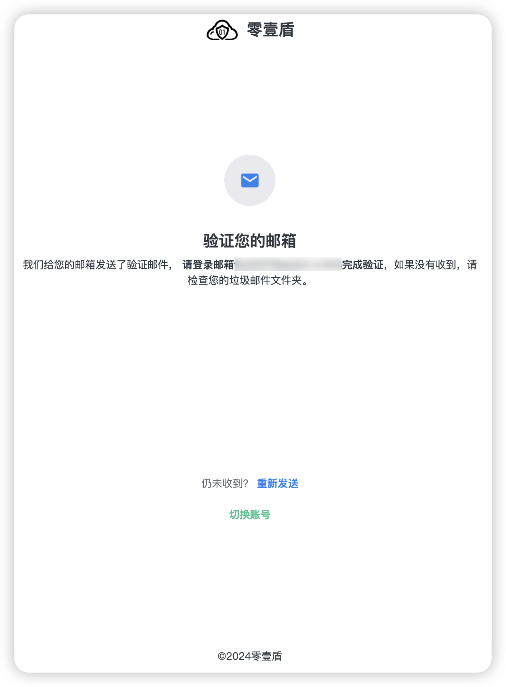

# 登录

### 访问[登录页面](https://dash.01dun.com/auth-login.html)

<figure><figcaption>
”登录“页面
</figcaption></figure>

### 输入您的邮箱地址和密码，并点击登录

如果您的邮箱地址还没有经过验证，则您会看到“验证您的邮箱”的提示，此时需要验证邮箱才能成功登录。“

<figure><figcaption>
”验证邮箱“提示
</figcaption></figure>

如果没有收到验证邮件，可以查找垃圾邮件文件夹。如果仍未找到，可以点击“重新发送”按钮，尝试重新获取验证邮件。

### 登录成功后，页面将跳转至 “概览” 页面

左侧菜单包含“站点”、“资金”、“账户”等相关选项

右侧以卡片形式列出了您当前接入的站点。

<figure><figcaption>
“概览” 页面
</figcaption></figure>

点击对应的站点，即可进入“站点仪表盘”。

