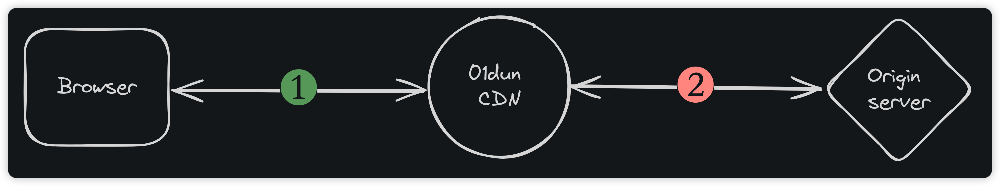

# 购买

### 访问 “[添加站点](https://dash.01dun.com/client/allsites/addsite.html)” 页面

您也可以登录控制台，并在左侧菜单中点击“添加站点”打开此页面

<figure><figcaption>
添加站点 step1
</figcaption></figure>

### 输入需要接入的域名

输入域名时，只需要填写主域名即可。


也就是说，您在域名商那里购买的域名是什么，就填写什么。不要包含任何前缀。

_假设您的网站访问地址是www.example.com，那么只需要填写example.com，不要包含前面的www。_


点击“下一步”进入“选择版本”页面，此时系统会检测域名是否可以接入。


* 如果可以接入，将会进入选择版本页面。
* 如果不允许接入，可能是其他用户已经添加了此域名，或是此域名禁止接入。如有疑问，可以联系客服查询。


### 选择您的版本

<figure><figcaption>
添加站点 step2
</figcaption></figure>

请根据自己的需求选择合适的付款周期和版本。


年付提供8折的优惠

免费版不支持年付操作


点击对应版本的 “选择” 按钮，进入下一步。

### 选择您的付款方式并确认订单信息

<figure><figcaption>
添加站点 step3
</figcaption></figure>

选择支付方式，并确认订单信息，确认无误后，点击右下角的提交订单按钮。

<figure><figcaption>
添加站点 step4
</figcaption></figure>

在弹出的订单确认窗口中，点击 “立即支付” 按钮。使用所选的支付方式完成支付。

### 支付成功

支付成功后，浏览器会跳转至“概览”页面。此时可以在右侧看到新接入的域名。

