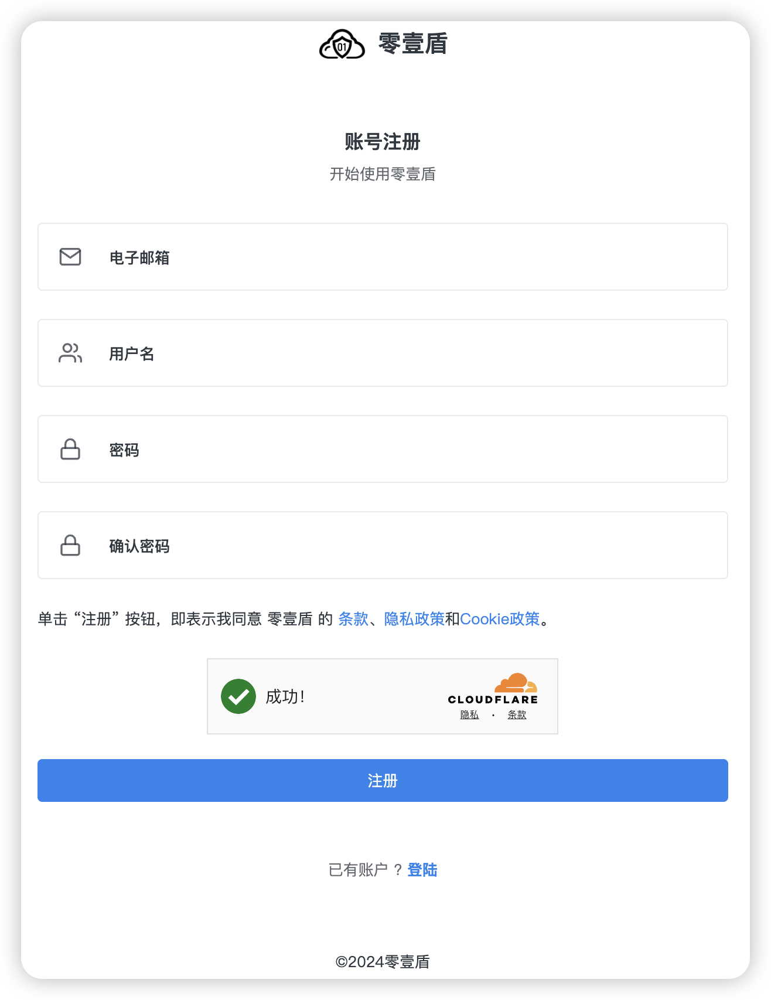

# 注册

### 1、访问[账号注册](https://dash.01dun.com/auth-register.html)页面

### 2、根据提示填写注册表单

<figure><figcaption></figcaption></figure>

### 3、邮箱地址必须是真实邮箱地址，注册后，系统将会发送验证邮件到您的邮箱

### 4、用户名长度限制在6-20个字符之间

### 5、密码复杂度要求：至少8位，包含大小写和数字

### 6、表单填写完毕后，点击注册按钮，等待注册成功的提示

### 7、登录您注册账号时填写的邮箱地址，查收激活邮件，点击邮件中的激活链接激活您的账号。

